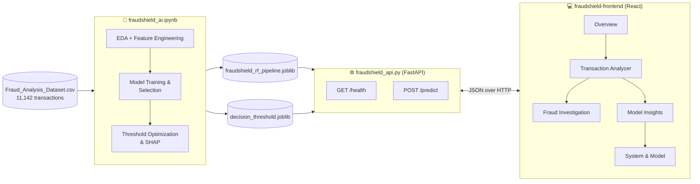

<div align="center">

# 🛡️ FraudShield AI

**Real-time transaction fraud detection — Random Forest model, FastAPI backend, React console**


</div>

---

## 📑 Contents

- [At a glance](#-at-a-glance)
- [System architecture](#-system-architecture)
- [Notebook pipeline](#-notebook-pipeline) — the flowchart
- [Known limitation](#-known-limitation)
- [Repository layout](#-repository-layout)
- [Model details](#-model-details)
- [Setup](#-setup)
- [API reference](#-api-reference)
- [Notes](#-notes)

---

## 📊 At a glance

Final held-out test set — **1,672 transactions, 172 fraudulent**, untouched
until the very last evaluation step:

| Metric | Score | | Metric | Score |
|---|---:|---|---|---:|
| Accuracy | **99.82%** | | ROC-AUC | **99.96%** |
| Precision | **98.84%** | | PR-AUC | **99.80%** |
| Recall | **99.42%** | | Fraud-amount capture | **99.99%** |
| F1 score | **99.13%** | | Decision threshold | **0.21** |

**Confusion matrix:** 171 true positives · 2 false positives · 1 false
negative · 1,498 true negatives

---

## 🏗️ System architecture



---

## 🔀 Notebook pipeline

The full path from raw data to a deployed model, mapped directly to the
13 levels in `fraudshield_ai.ipynb`:

```mermaid
flowchart TD
    START(["Fraud_Analysis_Dataset.csv\n11,142 rows · 10.25% fraud"])

    subgraph L1["Level 1 — Core ML Model"]
        direction TB
        S1["Load & inspect data"] --> S2["Exploratory Data Analysis\ntype · amount · balances · time"]
        S2 --> S3["Feature engineering\norigin_balance_change, origin_balance_error,\norigin_balance_match, origin_balance_fully_depleted…"]
    end
    START --> S1

    subgraph L3["Level 3 — Leakage Audit & Split"]
        SPLIT["Stratified 70/15/15 split\nrandom_state=42\nTrain 7,799 · Val 1,671 · Test 1,672"]
    end
    S3 --> SPLIT

    subgraph MODELS["Levels 4–7 — Model Development"]
        direction TB
        M1["Level 4\nLogistic Regression (baseline)"]
        M2["Level 5\nRandom Forest"]
        M3["Level 6\nXGBoost (baseline)"]
        M4["Level 7\nRF Hyperparameter Tuning\nRandomizedSearchCV"]
        M1 --> M2 --> M3 --> M4
    end
    SPLIT --> M1

    subgraph SELECT["Level 8 — Threshold Optimization"]
        TH["Sweep thresholds on validation set\n→ 0.21 selected\n100% precision · 98.25% recall"]
    end
    M4 -->|"Random Forest selected"| TH

    subgraph IMPACT["Levels 9–10 — Impact & Robustness"]
        direction TB
        FIN["Level 9\nFinancial Impact Analysis\n₹ detected vs. missed fraud"]
        TEMP["Level 10\nTemporal Validation\nfraud rate stable across step ranges"]
        FIN --> TEMP
    end
    TH --> FIN

    subgraph FINAL["Level 11 — Final Test Evaluation"]
        TEST["Score untouched test set\nAccuracy 99.82% · Recall 99.42% · F1 99.13%"]
    end
    TEMP --> TEST

    subgraph XAI["Level 12 — SHAP Explainability"]
        SHAP["TreeExplainer on validation set\ntop feature: origin_balance_fully_depleted"]
    end
    TEST --> SHAP

    subgraph EXPORT["Level 13 — Production Export"]
        direction TB
        SAVE["Save pipeline + metadata\n.joblib artifacts"]
        VERIFY["Reload & verify reproducibility\nnp.allclose on probabilities"]
        SAVE --> VERIFY
    end
    SHAP --> SAVE

    VERIFY --> API(["fraudshield_api.py\nFastAPI /predict"])
    API --> UI(["React console\n5-page frontend"])
```



**Key EDA findings that shaped the feature set** (Level 1, Step 5):
fraud only ever appears in `TRANSFER` and `CASH_OUT` transactions; fraud
transactions show a much stronger origin-balance-match pattern than
legitimate ones; and destination accounts typed as `Merchant` never carry
fraud in this dataset, while `Customer`-typed destinations do.

---

## ⚠️ Known limitation

The one false negative in the final test set has `oldbalanceOrg = 0`,
which blinds the model's strongest signal family — origin-balance-based
features (`origin_balance_fully_depleted` alone carries the highest SHAP
weight of any feature). That transaction's destination balance moves by
**exactly** the transaction amount — a mule-account pattern the model
doesn't currently see, because the destination-side mirror features
(`destination_balance_match`, `destination_balance_error`) were engineered
as candidates but dropped before the final 16-feature pipeline. Documented
here rather than glossed over — see **Model Insights** in the frontend for
the full breakdown.

---

## 📁 Repository layout

```
FraudShield-AI/
├── fraudshield_ai.ipynb                  training notebook (source of truth)
├── Fraud_Analysis_Dataset.csv            11,142 transactions, 10.25% fraud
├── description.txt                       dataset column reference
├── fraudshield_api.py                    FastAPI inference service
├── fraudshield_production/
│   ├── fraudshield_rf_pipeline.joblib    fitted sklearn Pipeline
│   └── decision_threshold.joblib         0.21
├── requirements.txt                      pinned Python dependencies
├── README.md                             this file
└── fraudshield-frontend/                 React console (5 pages)
    ├── README.md                         frontend-specific setup notes
    └── src/
```

---

## 🧠 Model details

| | |
|---|---|
| **Algorithm** | Random Forest (`n_estimators=400`, `min_samples_leaf=2`, `class_weight="balanced"`, `random_state=42`) |
| **Training data** | 11,142 transactions → stratified 70/15/15 split (Train 7,799 · Val 1,671 · Test 1,672) |
| **Features** | 23 engineered candidates → 16 after preprocessing (5 raw balance/amount fields, 6 balance-consistency signals, one-hot `type` + `destination_account_type`) |
| **Decision threshold** | 0.21 — F1-maximizing point on the validation sweep; lower thresholds recover no further true positives |
| **Explainability** | SHAP `TreeExplainer` — top signal is whether the origin account was fully drained |

---

## 🚀 Setup

### 1. Environment

```bash
python -m venv venv
source venv/Scripts/activate        # Mac: venv\bin\activate
pip install -r requirements.txt
```

### 2. Backend

```bash
uvicorn fraudshield_api:app --reload
```

Requires `fraudshield_production/fraudshield_rf_pipeline.joblib` and
`fraudshield_production/decision_threshold.joblib` on disk, exactly as
`fraudshield_api.py` already expects.


### 3. Frontend

```bash
cd fraudshield-frontend
npm install
npm run dev
```

Full page-by-page breakdown and data provenance are in
`fraudshield-frontend/README.md`.

---

## 🔌 API reference

| Method | Path | Purpose |
|---|---|---|
| `GET` | `/` | App metadata, model name, endpoint index |
| `GET` | `/health` | Liveness + current model + decision threshold |
| `POST` | `/predict` | Score one transaction |

**`POST /predict`** request body:

```json
{
  "amount": 42789.93,
  "transaction_type": "CASH_OUT",
  "oldbalanceOrg": 42789.93,
  "newbalanceOrig": 0.0,
  "oldbalanceDest": 0.0,
  "newbalanceDest": 42789.93,
  "destination_account_type": "Customer"
}
```

`transaction_type` ∈ `{CASH_IN, CASH_OUT, DEBIT, PAYMENT, TRANSFER}` ·
`destination_account_type` ∈ `{Customer, Merchant}` — the exact
categories the model was trained on.

Response:

```json
{
  "fraud_probability": 1.0,
  "prediction": 1,
  "decision": "FRAUD",
  "risk_level": "HIGH",
  "decision_threshold": 0.21
}
```

---

## 📝 Notes

- Dataset, notebook, and model artifacts are used exactly as provided —
  nothing here was retrained or re-engineered to produce this README or
  the frontend.
- The dataset is a simulated (PaySim-style) mobile-money dataset;
  performance here reflects that simulation and should be re-validated
  before any use on real transaction data.
